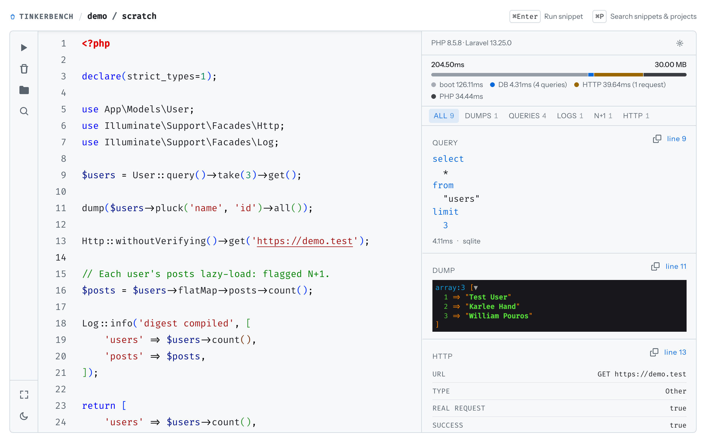

# tinkerbench



[](https://github.com/moessimple/tinkerbench/actions/workflows/tests.yml)

tinkerbench is a browser based REPL for any project linked in [Laravel Herd](https://herd.laravel.com).
Write a PHP snippet, run it against that project's own runtime, and see the output immediately, no separate setup per project.
A Laravel project produces a feed of dumps, database queries, log entries, exceptions, return values, and N+1 warnings. Any other project, Composer without Laravel or plain PHP, produces dumps, return values, and exceptions; the query, log, and N+1 tabs are not shown.
A take on Laravel's [`tinker`](https://github.com/laravel/tinker), inspired by [Tinkerwell](https://tinkerwell.app).

## Features

* Runs snippets against any Herd linked project, switching projects without leaving the page.
* Saves multiple named snippets per project. Create, rename, and delete them as needed.
* Command palette (`⌘P`) to jump between snippets and projects, similar to an editor's quick open.
* Monaco based editor with PHP syntax highlighting, autosave, and a run shortcut (`⌘Enter`).
* PHP autocompletion, hover documentation, and signature help for the target project's own code, powered by intelephense (the same language server VS Code uses).
* Output rendering adapts to the value: `dump()`/`dd()` calls use Symfony's interactive VarDumper, JSON is syntax highlighted, and HTML output renders in a sandboxed frame.
* A single chronological feed of everything a run touched, each entry as its own card in execution order: dumps, return values, and exceptions for any project, plus database queries, log entries, and N+1 warnings for a Laravel project. Filter by kind with live counts, and jump the editor to a card's source line.
* Query cards pretty-print and syntax-highlight their SQL, flag queries that ran more than once or slower than 100ms, and can be sorted slowest first. Every card has a button to copy its contents.
* Light and dark theme, switchable from the sidebar, defaulting to your system preference.

**tinkerbench runs locally on your own machine through Herd. It's a personal dev tool.**

## Requirements

* [Laravel Herd](https://herd.laravel.com)
* Target projects need PHP 8.2 or newer (`herd isolate` per project). Laravel 12 and 13 produce the full feed (dumps, queries, logs, exceptions, return values, N+1 warnings). Any other project, Composer without Laravel or plain PHP with no autoloader, produces dumps, return values, and exceptions. The snippet runner ships as its own package with a PHP 8.2 floor, so tinkerbench's own PHP 8.5 stack does not constrain the target.

## Installation

Clone the repository and run the setup script:

```bash
git clone git@github.com:moessimple/tinkerbench.git
cd tinkerbench
composer setup
```

`composer setup` installs dependencies, configures the environment, and links the project to Herd at [`https://tinkerbench.test`](https://tinkerbench.test).

## Usage

Open [`https://tinkerbench.test`](https://tinkerbench.test). It opens the `scratch` snippet in the `tinkerbench` project by default.

* Write PHP in the editor and run it with the play button or `⌘Enter`.
* Press `⌘P` to search snippets and projects, scope the search to snippets (`#` prefix) or another Herd project (`/` prefix), or create a new snippet by typing a name that doesn't exist yet.
* Clear the output or maximize the editor from the sidebar icons.

## Staying Up to Date

Pull the latest changes and rerun the setup script to bring dependencies and migrations back in sync:

```bash
git pull
composer setup
```

## Testing

Run the full quality gate (formatting, static analysis, type coverage, and the test suite):

```bash
composer test
```

## License

The MIT License (MIT). Please see [License File](LICENSE.md) for more information.
