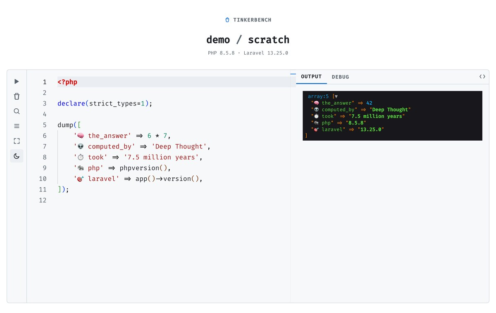

# tinkerbench



[](https://github.com/moessimple/tinkerbench/actions/workflows/tests.yml)

tinkerbench is a browser based REPL for any project linked in [Laravel Herd](https://herd.laravel.com).
Write a PHP snippet, run it against that project's own app context, and see the output immediately, no separate setup per project.
A take on Laravel's [`tinker`](https://github.com/laravel/tinker), inspired by [Tinkerwell](https://tinkerwell.app).

## Features

* Runs snippets against any Herd linked project, switch projects without leaving the page.
* Saves multiple named snippets per project. Create, rename, and delete them as needed.
* Command palette (`⌘P`) to jump between snippets and projects, similar to an editor's quick open.
* Monaco based editor with PHP syntax highlighting, autosave, and a run shortcut (`⌘Enter`).
* PHP autocompletion, hover documentation, and signature help for the target project's own code, powered by intelephense (the same language server VS Code uses).
* Raw or rendered output. Rendered mode shows `dump()`/`dd()` calls with Symfony's interactive VarDumper, syntax highlights JSON, and renders HTML output in a sandboxed frame.

tinkerbench runs locally on your own machine through Herd. There's no login and no support for multiple users, it's a personal dev tool.

## Roadmap

* A debug panel next to the output panel, showing the queries, timing, dumps, exceptions, and environment info a snippet run touched.
* A light theme alongside the current dark one, with a way to switch between them.

## Requirements

* [Laravel Herd](https://herd.laravel.com), with PHP 8.5 selected as the active version

## Installation

Clone the repository and run the setup script:

```bash
git clone git@github.com:moessimple/tinkerbench.git
cd tinkerbench
composer setup
```

`composer setup` installs dependencies, configures the environment, and links the project to Herd at `https://tinkerbench.test`.

Set `HERD_BIN` in `.env` if your Herd installation isn't in the default location. Same for `TINKERBENCH_NVM_EXEC` if Herd's Node isn't in the default location.

## Usage

Open [`https://tinkerbench.test`](https://tinkerbench.test). It opens the `scratch` snippet in the `tinkerbench` project by default.

* Write PHP in the editor and run it with the play button or `⌘Enter`.
* Press `⌘P` to search snippets, switch to another Herd project (`/` prefix), or create a new snippet by typing a name that doesn't exist yet.
* Toggle raw/rendered output, clear the output, or maximize the editor from the sidebar icons.

## Testing

Run the full quality gate (formatting, static analysis, type coverage, and the test suite):

```bash
composer test
```

## License

The MIT License (MIT). Please see [License File](LICENSE.md) for more information.
